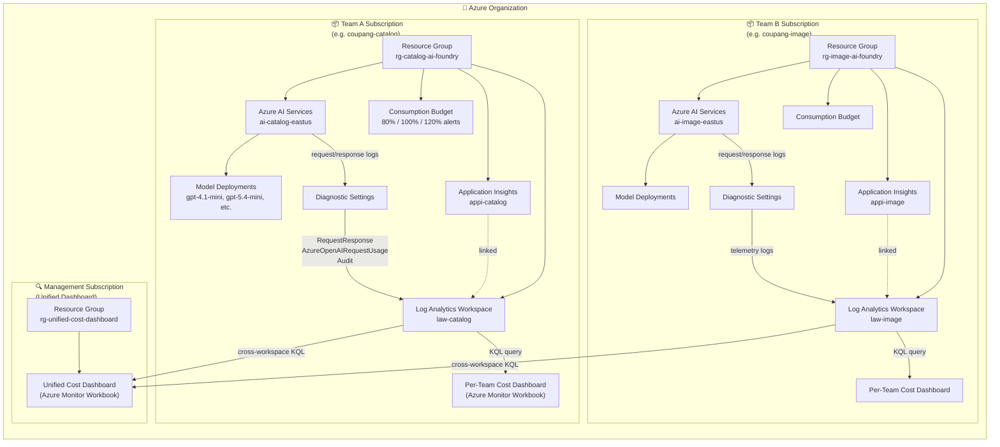

# foundry-based-cost-governance

🌐 [한국어 버전](README.md)

Per-team Azure Subscription isolation, key sharing, and usage monitoring sample for Azure AI Foundry

## Overview

A PoC sample that isolates Azure Subscriptions per Team, deploys AI Foundry resources into each Subscription, and manages **cost isolation** and **key management**.

### Architecture

#### Overall Structure

Each Team is assigned an independent Azure Subscription, and a separate **Management Subscription** provides a unified view of usage across all teams.



#### Why Separate Subscriptions?

| Purpose | Description |
|---------|-------------|
| **Cost Isolation** | Subscriptions are the fundamental boundary for Azure cost management. Separating by team automatically scopes budgets, billing, and cost analysis to each team. |
| **Governance Boundary** | RBAC policies, resource limits, and budget alerts can be applied independently per team. |
| **Management Subscription Separation** | The Unified Dashboard is placed in a separate Management Subscription, allowing organization-wide visibility without affecting individual team subscriptions. |

#### Data Flow (Telemetry Pipeline)

```
AI Services  →  Diagnostic Settings  →  Log Analytics  →  Workbook (KQL)
(API calls)     (log routing)           (storage)         (visualization)
```

1. Team members call the AI Services endpoint (Chat Completion, Embedding, etc.)
2. **Diagnostic Settings** forward `RequestResponse`, `AzureOpenAIRequestUsage`, and `Audit` logs to the Log Analytics Workspace
3. Each team's **Cost Dashboard** (Workbook) runs KQL queries against its own Log Analytics to visualize token usage and costs
4. The **Unified Dashboard** uses `workspace('<ARM_ID>').AzureDiagnostics` cross-workspace KQL to union-query all teams' Log Analytics, providing a consolidated dashboard

#### Key Resources Summary

- **Azure AI Services** (`ai-{team}-{region}`): AI service account hosting model deployments (e.g. gpt-4.1-mini) and Resource Keys (Key1, Key2)
- **Log Analytics Workspace** (`law-{team}`): Central store for all telemetry logs
- **Application Insights** (`appi-{team}`): APM linked to Log Analytics, used for request tracing
- **Cost Dashboard**: Azure Monitor Workbook using KQL queries to visualize token usage, estimated costs, and per-model statistics
- **Consumption Budget**: Sends email alerts when monthly budget thresholds (80%/100%/120%) are reached
- **Unified Cost Dashboard**: Cross-subscription KQL from the Management Subscription for organization-wide usage (daily token trends, per-model summary, cost trends, team comparison — 5 panels)

## Prerequisites

- **Azure Subscriptions**: 1 per team (e.g., catalog, image, search → 3 Subscriptions)
- **Service Principal**: `ARM_CLIENT_ID`, `ARM_CLIENT_SECRET`, `ARM_TENANT_ID` — Contributor role on all Subscriptions
- **Terraform** ≥ 1.5
- **Python** ≥ 3.11
- **jq** (used for JSON processing in the deploy script)

## Project Structure

```
├── infra/                  # Terraform IaC
│   ├── main.tf             # Azure AI Services, App Insights, Budget, Workbook
│   ├── variables.tf        # Input variable definitions
│   ├── outputs.tf          # Per-team endpoint/key outputs
│   ├── versions.tf         # Provider versions
│   └── envs/               # Per-team tfvars
│       ├── catalog.tfvars
│       ├── image.tfvars
│       └── search.tfvars
├── scripts/
│   └── deploy_all.sh       # Multi-team Terraform deployment orchestrator
├── src/
│   └── auth/
│       └── key_export.py   # Terraform output JSON → Excel conversion
├── notebooks/
│   └── verify_key.ipynb    # API key verification sample notebook
├── tests/
│   └── test_key_export.py  # key_export unit tests
├── output/                 # (gitignored) Deployment artifacts
│   ├── consolidated_outputs.json
│   └── team_keys.xlsx
├── requirements.txt
├── sample.env
└── README.md
```

## Quick Start

### 1. Clone & Setup

```bash
git clone <repo-url>
cd foundry-based-cost-governance

python -m venv .venv
source .venv/bin/activate
pip install -r requirements.txt
```

### 2. Set Environment Variables

```bash
cp sample.env .env
```

Edit the `.env` file to enter your Service Principal credentials:

```bash
export ARM_CLIENT_ID="<service-principal-app-id>"
export ARM_CLIENT_SECRET="<service-principal-password>"
export ARM_TENANT_ID="<azure-ad-tenant-id>"
export ALERT_EMAIL="team-lead@example.com"
export MONTHLY_BUDGET_USD=100
```

### 3. Edit Per-Team tfvars

Enter the team Subscription ID and model deployment settings in each `.tfvars` file under the `infra/envs/` directory:

```hcl
# infra/envs/catalog.tfvars
team_name       = "catalog"
subscription_id = "<catalog-team-subscription-id>"
alert_email     = "catalog-team@example.com"

regions = {
  "eastus" = [
    { name = "gpt-4o", model = "gpt-4o", version = "2024-11-20", sku_name = "GlobalStandard", capacity = 30 },
    { name = "text-embedding-3-large", model = "text-embedding-3-large", version = "1", sku_name = "Standard", capacity = 120 },
  ]
}
```

### 4. Run Deployment

```bash
# Load environment variables
source .env

# Dry run (plan-only)
./scripts/deploy_all.sh --plan-only

# Actual deployment
./scripts/deploy_all.sh
```

`deploy_all.sh` performs the following:
1. Auto-detects the team list from `infra/envs/*.tfvars`
2. Creates a Terraform workspace per team and runs `apply`
3. Collects Terraform output from all teams into `output/consolidated_outputs.json`
4. Generates `output/team_keys.xlsx` using `src/auth/key_export.py`

### 5. Key Verification

Verify that the API keys in the generated Excel file are working:

```bash
# Verify in Jupyter Notebook
jupyter notebook notebooks/verify_key.ipynb
```

The notebook reads endpoints and API keys from the Excel file and tests Chat Completion and Embedding calls.

## Cost Dashboard

After deployment, you can check per-team costs in the Azure Portal:

1. **Azure Portal** → Select the Team Subscription
2. **Application Insights** → **Workbooks** menu
3. View token usage/cost visualization in the Cost Dashboard Workbook deployed by Terraform

Budget Alert sends notifications to `alert_email` when 80%, 100%, and 120% of the `monthly_budget_usd` threshold (default 100 USD) is reached.

## Security Note

> **⚠️ This sample is intended for PoC/learning purposes only.**

- API keys are stored in **plaintext** in `output/team_keys.xlsx`
- The Excel file is included in `.gitignore` — never commit it to Git
- **For production environments**, the following are recommended:
  - Store keys in Azure Key Vault
  - Use Entra ID (`DefaultAzureCredential`) based authentication
  - Manage per-team access permissions with RBAC

## License

MIT
