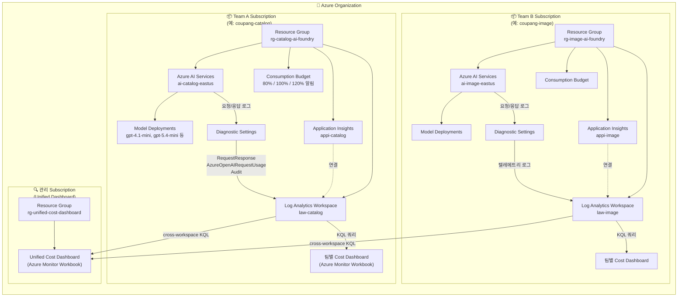

# foundry-based-cost-governance

🌐 [English version](README.en.md)

Azure AI Foundry 팀별 Subscription 분리, 키 공유, 사용량 모니터링 샘플

## Overview

팀(Team)별로 Azure Subscription을 분리하고, 각 Subscription에 AI Foundry 리소스를 배포하여 **비용 격리**와 **키 관리**를 수행하는 PoC 샘플입니다.

### Architecture

#### 전체 구조

팀(Team)마다 독립된 Azure Subscription을 할당하고, 별도의 **관리 Subscription**에서 전체 팀의 사용량을 통합 조회하는 구조입니다.



#### 왜 Subscription을 분리하는가?

| 목적 | 설명 |
|------|------|
| **비용 격리** | Subscription이 Azure 비용 관리의 기본 경계입니다. 팀별로 분리하면 예산·청구·비용 분석이 자동으로 팀 단위가 됩니다. |
| **거버넌스 경계** | RBAC 정책, 리소스 제한, 예산 알림을 팀마다 독립 적용할 수 있습니다. |
| **관리 구독 분리** | Unified Dashboard는 별도 관리 Subscription에 배치하여, 개별 팀 구독에 영향 없이 전체 현황을 조회합니다. |

#### 데이터 흐름 (텔레메트리 파이프라인)

```
AI Services  →  Diagnostic Settings  →  Log Analytics  →  Workbook (KQL)
(API 호출)      (로그 라우팅)            (저장소)          (시각화)
```

1. 팀원이 AI Services endpoint로 API 호출 (Chat Completion, Embedding 등)
2. **Diagnostic Settings**가 `RequestResponse`, `AzureOpenAIRequestUsage`, `Audit` 로그를 Log Analytics Workspace로 전송
3. 각 팀의 **Cost Dashboard**(Workbook)가 자체 Log Analytics에 KQL 쿼리를 실행하여 토큰 사용량·비용 시각화
4. **Unified Dashboard**는 `workspace('<ARM_ID>').AzureDiagnostics` cross-workspace KQL로 모든 팀의 Log Analytics를 union 쿼리하여 통합 대시보드 제공

#### 주요 리소스 요약

- **Azure AI Services** (`ai-{team}-{region}`): 모델 배포(gpt-4.1-mini 등)와 Resource Key(Key1, Key2)를 보유하는 AI 서비스 계정
- **Log Analytics Workspace** (`law-{team}`): 모든 텔레메트리 로그의 중앙 저장소
- **Application Insights** (`appi-{team}`): Log Analytics와 연결된 APM, 요청 추적에 활용
- **Cost Dashboard**: Azure Monitor Workbook 기반, KQL 쿼리로 토큰 사용량·예상 비용·모델별 통계 시각화
- **Consumption Budget**: 월간 예산 임계값(80%/100%/120%)에 도달 시 이메일 알림 발송
- **Unified Cost Dashboard**: 관리 Subscription에서 cross-subscription KQL로 전체 팀 사용량 통합 조회 (일별 토큰 추이, 모델별 요약, 비용 트렌드, 팀 비교 등 5개 패널)

## Prerequisites

- **Azure Subscriptions**: 팀당 1개 (예: catalog, image, search → 3개 Subscription)
- **Service Principal**: `ARM_CLIENT_ID`, `ARM_CLIENT_SECRET`, `ARM_TENANT_ID` — 모든 Subscription에 Contributor 권한
- **Terraform** ≥ 1.5
- **Python** ≥ 3.11
- **jq** (deploy 스크립트에서 JSON 처리에 사용)

## Project Structure

```
├── infra/                  # Terraform IaC
│   ├── main.tf             # Azure AI Services, App Insights, Budget, Workbook
│   ├── variables.tf        # 입력 변수 정의
│   ├── outputs.tf          # 팀별 endpoint/key 출력
│   ├── versions.tf         # provider 버전
│   └── envs/               # 팀별 tfvars
│       ├── catalog.tfvars
│       ├── image.tfvars
│       └── search.tfvars
├── scripts/
│   └── deploy_all.sh       # 멀티팀 Terraform 배포 오케스트레이터
├── src/
│   └── auth/
│       └── key_export.py   # Terraform output JSON → Excel 변환
├── notebooks/
│   └── verify_key.ipynb    # API 키 검증 샘플 노트북
├── tests/
│   └── test_key_export.py  # key_export 유닛 테스트
├── output/                 # (gitignored) 배포 결과물
│   ├── consolidated_outputs.json
│   └── team_keys.xlsx
├── requirements.txt
├── sample.env
└── README.md
```

## Quick Start

### 1. Clone & Setup

```bash
git clone <repo-url>
cd foundry-based-cost-governance

python -m venv .venv
source .venv/bin/activate
pip install -r requirements.txt
```

### 2. 환경 변수 설정

```bash
cp sample.env .env
```

`.env` 파일을 편집하여 Service Principal 정보를 입력합니다:

```bash
export ARM_CLIENT_ID="<service-principal-app-id>"
export ARM_CLIENT_SECRET="<service-principal-password>"
export ARM_TENANT_ID="<azure-ad-tenant-id>"
export ALERT_EMAIL="team-lead@example.com"
export MONTHLY_BUDGET_USD=100
```

### 3. 팀별 tfvars 편집

`infra/envs/` 디렉토리의 각 `.tfvars` 파일에 팀 Subscription ID와 모델 배포 설정을 입력합니다:

```hcl
# infra/envs/catalog.tfvars
team_name       = "catalog"
subscription_id = "<catalog-team-subscription-id>"
alert_email     = "catalog-team@example.com"

regions = {
  "eastus" = [
    { name = "gpt-4o", model = "gpt-4o", version = "2024-11-20", sku_name = "GlobalStandard", capacity = 30 },
    { name = "text-embedding-3-large", model = "text-embedding-3-large", version = "1", sku_name = "Standard", capacity = 120 },
  ]
}
```

### 4. 배포 실행

```bash
# 환경 변수 로드
source .env

# 드라이런 (plan-only)
./scripts/deploy_all.sh --plan-only

# 실제 배포
./scripts/deploy_all.sh
```

`deploy_all.sh`는 다음을 수행합니다:
1. `infra/envs/*.tfvars`에서 팀 목록 자동 탐지
2. 팀별로 Terraform workspace 생성 및 `apply`
3. 모든 팀의 Terraform output을 `output/consolidated_outputs.json`으로 수집
4. `src/auth/key_export.py`로 `output/team_keys.xlsx` 생성

### 5. 키 검증

생성된 Excel 파일로 API 키가 작동하는지 확인합니다:

```bash
# Jupyter Notebook에서 검증
jupyter notebook notebooks/verify_key.ipynb
```

노트북은 Excel에서 endpoint와 API 키를 읽어 Chat Completion, Embedding 호출을 테스트합니다.

## Cost Dashboard

배포 완료 후 Azure Portal에서 팀별 비용을 확인할 수 있습니다:

1. **Azure Portal** → 해당 Team Subscription 선택
2. **Application Insights** → **Workbooks** 메뉴
3. Terraform이 배포한 Cost Dashboard Workbook에서 토큰 사용량/비용 시각화 확인

Budget Alert는 `monthly_budget_usd` 임계값(기본 100 USD)의 80%, 100%, 120% 도달 시 `alert_email`로 알림을 발송합니다.

## Security Note

> **⚠️ 이 샘플은 PoC/학습 목적입니다.**

- `output/team_keys.xlsx`에 API 키가 **평문**으로 기록됩니다
- Excel 파일은 `.gitignore`에 포함하고, 절대 Git에 커밋하지 마십시오
- **프로덕션 환경**에서는 다음을 권장합니다:
  - Azure Key Vault에 키 저장
  - Entra ID (`DefaultAzureCredential`) 기반 인증
  - RBAC으로 팀별 접근 권한 관리

## License

MIT
